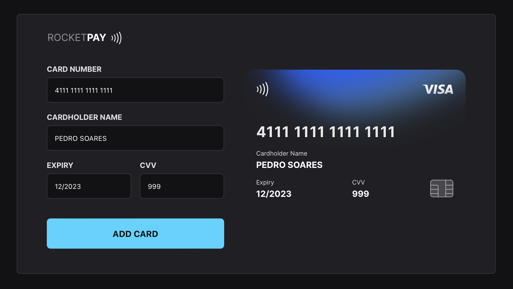
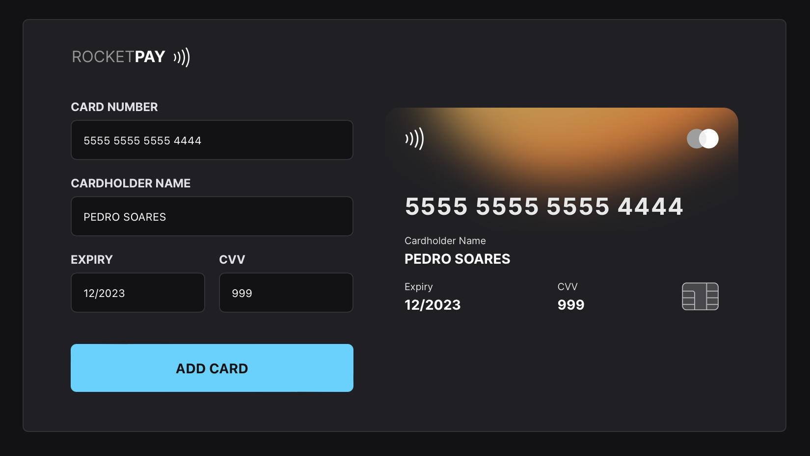

# JS DOM | Explorer Lab

## Features

- [x] Live card image update as user types
    - [x] Card Number
    - [x] Cardholder Name
    - [x] Expiry
    - [x] CVV
- [x] Card color update to match VISA or MASTERCARD taking into account the card card number that the user wrote
- [x] Button to simulate card add (no data is collected 🙈)
- [x] Toast notifications

## Card types supported so far

### VISA

- Starts with 4 and have a total of 15 numbers

### MASTERCARD

- Starts with 5 followed by a number between 1 and 5 followed by two more numbers followed by 12 more numbers

  OR

- Starts with 22 followed by a number between 2 and 9 followed by one more number followed by 12 more numbers

  OR

- Starts with 2 followed by a number between 3 and 7 followed by two more numbers followed by 12 more numbers

## Technologies

- [HTML](https://developer.mozilla.org/en-US/docs/Web/HTML)
- [CSS](https://developer.mozilla.org/en-US/docs/Web/css)
- [JavaScript](https://developer.mozilla.org/en-US/docs/Web/javascript)
- [JSON](https://www.json.org/json-en.html)
- [Node](https://nodejs.org/)
- [Vite](https://vitejs.dev/)
- [iMask](https://imask.js.org)
- [Toastify](https://github.com/apvarun/toastify-js/blob/master/README.md)

## Project

Rocketpay is a component that simulates a credit/debit card payment form.
It allows to add a input mask and update DOM elements via JavaScript.

## Layout

👉 [Figma URL](https://www.figma.com/file/gpqavL469k0pPUGOmAQEM9/Explorer-Lab-%2301/duplicate)

You need to have a [Figma](https://figma.com) account in order to access it.

## License

MIT

---

Made with ♥ by [Pedro Soares](https://github.com/pncsoares) within Rocketseat Next Level Week | JS DOM | Explorer Lab 2022 🙌 
