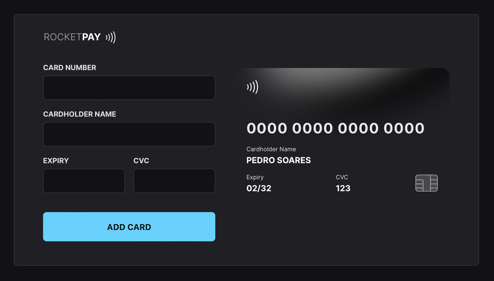

# Explorer Lab #01

## Technologies

- [HTML](https://developer.mozilla.org/en-US/docs/Web/HTML)
- [CSS](https://developer.mozilla.org/en-US/docs/Web/css)
- [JavaScript](https://developer.mozilla.org/en-US/docs/Web/javascript)
- [JSON](https://www.json.org/json-en.html)
- [Node](https://nodejs.org/)
- [Vite](https://vitejs.dev/)
- [iMask](https://imask.js.org)
- [toastify](https://github.com/apvarun/toastify-js/blob/master/README.md)

## Project

Rocketpay is a component that simulates a credit/debit card payment form.
It allows to add a input mask and update DOM elements via JavaScript.

## Layout

👉 [Figma URL](https://www.figma.com/file/gpqavL469k0pPUGOmAQEM9/Explorer-Lab-%2301/duplicate)

You need to have a [Figma](https://figma.com) account in order to access it.

## License

MIT

---

Made with ♥ by [Pedro Soares](https://github.com/pncsoares) within Rocketseat Next Level Week | JS DOM | Explorer Lab 2022 🙌 
